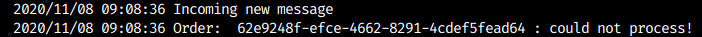

# Microsserviços se comunicando utilizando filas

## Informações do desafio
Agora que você viu na prática como podemos trabalhar com filas utilizando o RabbitMQ,
gostaríamos que você reproduzisse o que foi passado no vídeo. Para isso faça:

1. Acesse o repositório oficial do AvançaDev, deixe sua estrelinha e realize um fork.
2. Inicie o RabbitMQ e faça as configurações das duas filas e das duas exchanges.
3. Coloque os microsserviços para funcionar.
4. Tire 3 prints de sua de sua tela mostrando os microsserviços funcionando nas 3 situações:
  Cupom inválido, Processed e Connection error.
5. Crie um arquivo README.md anexando as 3 imagens no seu repositório.

| Status           | Imagem                              |
| ---------------- | ----------------------------------- |
| inválido         |     |
| Processed        |          |
| Connection error |  |
